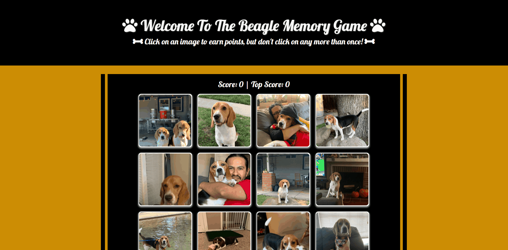

# Memory-Game

## Summary 
This software contains an application called, Welcome to the Beagle Memory Game. When this application loads, the user is presented with a landing page containing 12 beagle cards of Jax and Juniper. The purpose of the application is a memory game, the user clicks on a beagle card and the cards shuffle when clicked. If the user clicks on a card that has not been clicked on, the user gets a point and it's displayed on top of the page. The user may keep on clicking on other cards until every card has been clicked, total of 12 cards. If the user clicks on a card that has already been clicked on, then the user has lost and the score is reset to 0. The top score will remain in place until the page is refreshed or the user beats the previous high scores.

## Site


## Technologies
* HTML - Used to build the website
* CSS - Used to style the website
* Bootstrap 4.6 - Used as the CSS framework 
* React - Used on the client side
* Git - Used to upload to to github
* GitHub - Used to store the repository
## Code Snippet
This code snippet is from App.js where the application uses react to render the BeagleCard over and over again. I included this snippet because I think react is really cool in being able to use a component over and over again.

```javascript
<Wrapper>
    <h4 className="score">Score: {this.state.score}  | Top Score: {this.state.topScore} </h4>
    <div>
        <div class="container">
            <div class="row justify-content-md-center">
                {this.state.beagles.map(beagle => (
                    <BeagleCard
                        id={beagle.id}
                        key={beagle.id}
                        image={beagle.image}
                        handler={this.handlePicClick}
                        />
                ))}
            </div>
        </div>
    </div>
</Wrapper>
```
## Repository Link
https://github.com/javimarashall/Memory-Game

## Deploy Link


## Portfolio Link


## Personal Links
[Github](https://github.com/javimarashall)<br>
[Linkedin](https://www.linkedin.com/in/javier-mondragon-7b471719b/)